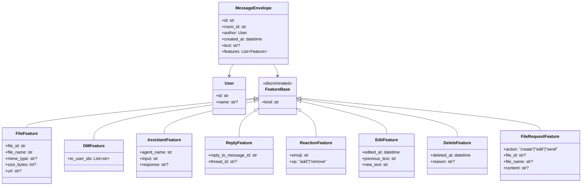
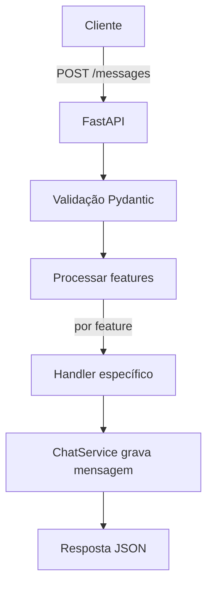

# Chat Application Example with Pydantic Features

Este projeto é um exemplo funcional de uma API de chat construída em **FastAPI** e **Pydantic**.  O objetivo é demonstrar como criar um envelope de mensagem extensível usando *Pydantic* para modelar cada funcionalidade (feature) do chat como um objeto independente.  A mesma estrutura de modelos pode ser consumida por um frontend em **Flet** ou qualquer outra interface, garantindo que o contrato de dados seja único e reutilizável.

## Visão geral

No centro da aplicação está o modelo `MessageEnvelope`, que contém dados básicos de uma mensagem (identificador, sala, autor, texto, data/hora) e uma lista de **features**.  Cada feature é uma subclasse de `FeatureBase` e é identificada pelo campo discriminador `kind`.  Isso permite adicionar novas capacidades ao chat sem quebrar contratos existentes.  Os principais tipos de feature implementados são:

- **FileFeature** — anexos de arquivo a uma mensagem.
- **DMFeature** — indica que a mensagem é um *direct message* (destinado a usuários específicos).
- **AssistantFeature** — chama um assistente virtual (ex.: *programador*) e armazena a entrada e a resposta.
- **ReplyFeature** — permite reply/thread, referenciando outra mensagem.
- **ReactionFeature** — adiciona ou remove uma reação (emoji) a uma mensagem.
- **EditFeature** — registra a edição de uma mensagem, incluindo o texto anterior e o novo.
- **DeleteFeature** — marca uma mensagem como removida, com data e motivo.
- **FileRequestFeature** — solicita ao backend que crie, edite ou envie um arquivo; o serviço de arquivo processa a solicitação e converte em `FileFeature`.

### Diagrama de classes (Mermaid)



## Arquitetura de pastas

```
chatapp_example/
├── Dockerfile              # Container para executar a API
├── README.md               # Este documento
├── requirements.txt        # Dependências Python
└── app
    ├── __init__.py
    ├── main.py             # Ponto de entrada FastAPI
    ├── core
    │   └── config.py       # Configurações e constantes
    ├── models
    │   ├── __init__.py
    │   ├── user.py         # Modelo User
    │   ├── message.py      # MessageEnvelope
    │   └── feature.py      # Base e subclasses de features
    └── services
        ├── __init__.py
        ├── chat_service.py      # Armazena e recupera mensagens
        ├── file_service.py      # Gerencia upload/criação de arquivos
        └── assistant_service.py # Serviço para chamar assistentes
```

## Executando a aplicação

1. **Instale as dependências** (caso esteja executando localmente):

```bash
python -m venv .venv
source .venv/bin/activate
pip install -r requirements.txt
```

2. **Inicie a API**:

```bash
uvicorn app.main:app --reload
```

3. **Via Docker**:

```bash
docker build -t chatapp_example .
docker run -p 8000:8000 chatapp_example
```

4. A aplicação estará acessível em `http://localhost:8000`.  Use a interface automática do FastAPI para testar (em `http://localhost:8000/docs`).

## Endpoints principais

### POST `/messages`

Envia uma mensagem para uma sala.  Recebe um objeto JSON no padrão `MessageCreate` (equivalente a `MessageEnvelope` sem `id` e `created_at`, pois são gerados automaticamente).  Exemplo de payload com features:

```json
{
  "room_id": "geral",
  "author": { "id": "u1", "name": "Marcelo" },
  "text": "Olá, veja esse arquivo!",
  "features": [
    { "kind": "file", "file_id": "abc123", "file_name": "foto.png", "mime_type": "image/png" },
    { "kind": "dm", "to_user_ids": ["u2"] },
    { "kind": "reply", "reply_to_message_id": "msg42" }
  ]
}
```

A API processa cada feature de forma independente.  Se houver `AssistantFeature`, o serviço de assistente é invocado.  Se houver `FileRequestFeature`, o `FileService` cria ou edita o arquivo e converte em `FileFeature` antes de persistir.

### GET `/rooms/{room_id}/messages`

Retorna a lista de mensagens de uma sala.  Exemplo de resposta:

```json
[
  {
    "id": "c8bf3f48-27ef-4eac-b753-a9f6446bd4a4",
    "room_id": "geral",
    "author": { "id": "u1", "name": "Marcelo" },
    "created_at": "2026-02-23T14:00:00.000Z",
    "text": "Olá, veja esse arquivo!",
    "features": [
      { "kind": "file", "file_id": "abc123", "file_name": "foto.png", "mime_type": "image/png" },
      { "kind": "dm", "to_user_ids": ["u2"] }
    ]
  },
  ...
]
```

### Servindo arquivos

O diretório de uploads (`uploads/`) é montado automaticamente em `/files`.  Qualquer arquivo criado pelo `FileService` estará disponível em `http://localhost:8000/files/<nome-do-arquivo>`.

## Fluxo de envio de mensagem (Mermaid)



## Considerações

- **Pydantic v2** é usado para definir os modelos e aplicar a união discriminada de features.  Todas as validações são aplicadas automaticamente.
- Os serviços são desacoplados e podem ser substituídos (por exemplo, trocar armazenamento de arquivos local por S3 ou integrar a um modelo de linguagem real).
- Este é um **exemplo minimalista**, destinado a ilustrar a arquitetura e os padrões.  Amplie conforme suas necessidades.